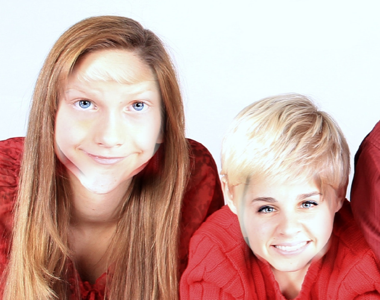

## Completing your Face Swap

Now that we have code which finds the faces in an image, swaps the sizes, reflects the direction, and blurs the edges, we need to put the new faces onto the original image.

In the "Basic Face Swap" step, we used `ImageCompose` to swap the images. We can do the same with our edited faces, using the new variables `newFace1` and `newFace2`.

We still want to use the same `facePositions` we used in "Basic Face Swap".

--- task ---
Put `newFace1` and `newFace2` onto the original image in their swapped positions, using `ImageCompose`

```
ImageCompose[i, {newFace1, newFace2}, {facePositions[[2]], facePositions[[1]]}]
```


---/task ---

--- task ---

Pull all of your code together, and supress the output for each line (except for `ImageCompose`).


```
faceImages = FindFaces[i, "Image"];

facePositions = FindFaces[i, "Position"];

newFace1 = ImageEffect[ImageReflect[ImageResize[faceImages[[1]], ImageDimensions[faceImages[[2]]]], Left], {"FadedFrame", Scaled[1/4]}];

newFace2 = ImageEffect[ImageReflect[ImageResize[faceImages[[2]], ImageDimensions[faceImages[[1]]]], Left], {"FadedFrame", Scaled[1/4]}];

ImageCompose[i, {newFace1, newFace2}, {facePositions[[2]], facePositions[[1]]}]
  ```

---/task---


Congratulations! You have created a face swap tool. Try replacing the image `i` with a different image (of two people, facing the camera), or even a photo of yourself and a friend.


